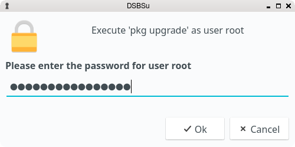

:toc:
:toc-position: preamble
:toclevels: 4
ifdef::env-github[]
:tip-caption: :bulb:
:note-caption: :information_source:
:important-caption: :heavy_exclamation_mark:
:caution-caption: :fire:
:warning-caption: :warning:
endif::[]

= DSBSu - a Qt frontend to su(1)

toc::[]

== About

_DSBSu_ is a Qt front-end which allows executing commands as another user using
_su_(1). _dsbsudo_ is a wrapper script for _sudo_(8) which uses _dsbsu_ for
asking for a password if necessary.

== Installation

=== Dependencies

* https://freshports.org/devel/qt5-buildtools[devel/qt5-buildtools]
* https://freshports.org/devel/qt5-core[devel/qt5-core]
* https://freshports.org/devel/qt5-linguisttools[devel/qt5-linguisttools]
* https://freshports.org/devel/qt5-qmake[devel/qt5-qmake]
* https://freshports.org/x11-toolkits/qt5-gui[x11-toolkits/qt5-gui]
* https://freshports.org/x11-toolkits/qt5-widgets[x11-toolkits/qt5-widgets]

==== Getting the Source Code

[source,sh]
----
% git clone https://github.com/mrclksr/DSBSu.git
----

==== Building and Installation

[source,sh]
----
# cd DSBSu && qmake
# make && make install
----

=== Installing via _pkg(8)_

[source,sh]
----
# pkg install dsbsu
----

=== Installing from the FreeBSD Ports

[source,sh]
----
# cd /usr/ports/sysutils/dsbsu
# make install distclean
----

== Usage

=== Command-Line

*dsbsu* [*-m* *_message_*][*-u* *_user_*] *_command_* +
*dsbsu* *-a* [*-c* *_command_*] +
*dsbsudo* [*_sudo options_*] *_command_* [*_args ..._*]

==== Options

*-a*::	Writes the entered password to stdout, and exits.

*-c*::	Shows the given _command_ string in the password window.

*-m*::	Shows the given _message_ in the password window.

*-u*::	Runs the _command_ as the given _user_.	If *-u* is not defined,
	root is assumed.

== Development

=== Contributing Translations

==== Available Translations

* French
* German

==== Instructions

Let's say you want to add translations for Russian, you can proceed as follows:

. Create a fork of this repo, and clone it:
+
[source,sh]
----
% git clone url-of-your-fork
----
. Install `devel/qt5-linguist` and `devel/qt5-linguisttools`
. `cd` to `your-forked-dsbsu-dir`
. Add `locale/$${PROGRAM}_ru.ts` to `TRANSLATIONS` in `dsbsu.pro`.
. Execute `lupdate dsbsu.pro`
. Run `linguist locale/dsbsu_ru.ts`
. Add the file to the repo: `git add locale/dsbsu_ru.ts`
. Commit: `git commit -am 'Add Russian translations.'`
. Send a pull request.

[[look]]
== Configuring the Look and Behavior of Qt5 Applications

If you are not using a desktop environment like KDE or GNOME, there are
two ways to control the appearance of Qt5 applications:

* <<kvantum,qt5ct and the Kvantum theme engine>>
* <<qt5-style-plugins,Qt5-style-plugins>>

[[kvantum]]
=== qt5ct and the Kvantum theme engine

==== qt5ct

https://freshports.org/misc/qt5ct[_qt5ct_] is a tool that allows you to
configure themes, fonts, and icons of Qt5 applications.
It can be installed via `pkg`

[source,sh]
----
# pkg install qt5ct
----

or via the FreeBSD ports:

[source,sh]
----
# cd /usr/ports/misc/qt5ct
# make install
----

In order to make Qt5 applications use _qt5ct_, add the line
`export QT_QPA_PLATFORMTHEME=qt5ct` to one of the following files, depending
on how you start your X session:

[[session_files]]
.Session Files
[options="header,footer"]
|==================================================
|X Session Start Method           |File
|_SliM_, _startx_, _xinit_        |`~/.xinitrc`
|_GDM_, _LightDM_, _LXDM_, _SDDM_ |`~/.xprofile`
|_WDM_, _XDM_                     |`~/.xsession`
|==================================================

Alternatively, you can add the line to your window manager's startup
script, or, if you are using a Bourne shell compatible login shell, to
your `~/.profile`.

After loggin out and in again, proceed with the next section.

==== Kvantum

https://www.freshports.org/x11-themes/Kvantum[_Kvantum_] is a SVG-based theme
engine for Qt, KDE and LXQt. Install it via `pkg`:

[source, sh]
----
# pkg install Kvantum-qt5
----

or via the FreeBSD ports:

[source,sh]
----
# cd /usr/ports/x11-themes/Kvantum
# make install distclean
----

Start `qt5ct` and choose *_kvantum_* under *_Appeareance_* -> *_Style_*, and
press _Ok_.

[TIP]
====
You can use _Kvantum_ directly without _qt5ct_ by setting
`QT_STYLE_OVERRIDE=kvantum`. Note, however, that the _Kvantum Manager_
lacks the ability to change fonts and the icon theme.
====

Now you can start `kvantummanager` to set, install and configure themes.

[TIP]
====
You can download
link:https://store.kde.org/browse/cat/123/order/latest[Kvantum themes]
from https://store.kde.org[KDE Store]. Unpack them, and use the
_Kvantum Manager_ to install new themes.
====

[[qt5-style-plugins]]
=== Qt5-style-plugins

https://www.freshports.org/x11-themes/qt5-style-plugins/[Qt5-style-plugins]
is a theme engine which allows using GTK-2 themes with Qt5 applications.
Install it via `pkg`

[source,sh]
----
# pkg install qt5-style-plugins
----

or via the FreeBSD ports

[source,sh]
----
# cd /usr/ports/x11-themes/qt5-style-plugins
# make install distclean
----

In order to make Qt5 applications use qt5-style-plugins, add the line
`export QT_QPA_PLATFORMTHEME=gtk2` to one of the following files, depending
on how you start your X session:

.Session Files
[options="header,footer"]
|==================================================
|X Session Start Method           |File
|_SliM_, _startx_, _xinit_        |`~/.xinitrc`
|_GDM_, _LightDM_, _LXDM_, _SDDM_ |`~/.xprofile`
|_WDM_, _XDM_                     |`~/.xsession`
|==================================================

Alternatively, you can add the line to your window manager's startup
script, or, if you are using a Bourne shell compatible login shell, to
your `~/.profile`.

After loggin out and in again, your Qt5 applications should look like your
GTK applications.
